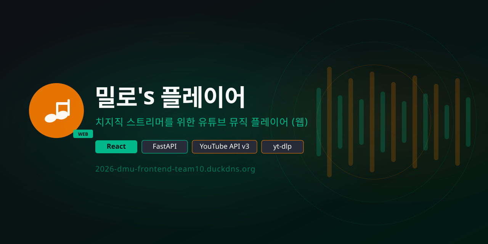

<div align="center">



[](https://react.dev)
[](https://fastapi.tiangolo.com)
[](https://developers.google.com/youtube/v3)
[](LICENSE)
[](https://milo-player.duckdns.org/)

**[🌐 지금 접속하기](https://milo-player.duckdns.org/)** · **[🐛 문제 신고](../../issues)**

</div>

---

# 🎵 밀로's 플레이어 (Milo's Player)

YouTube 기반 웹 뮤직 플레이어 — 보안 강화 + 실시간 랭킹 시스템

## 🎯 프로젝트 개요

- **프론트엔드**: React 18 + Vite (포트 5173)
- **백엔드**: FastAPI + yt-dlp (포트 8000)
- **리버스 프록시**: Nginx (포트 80)
- **데이터 저장**: JSON 파일 기반 (playback_stats.json)
- **배포 환경**: Oracle Cloud Infrastructure (OCI)

---

## ✨ 주요 기능

| 기능 | 설명 |
|------|------|
| 🔍 **음악 검색** | 키워드 검색 또는 YouTube URL · 플레이리스트 직접 입력 |
| 📊 **실시간 랭킹** | Top 3 영상 + 카테고리별 랭킹 (100위까지 페이지네이션) |
| 🎚️ **플레이어** | 셔플, 반복, 음량 조절, 드래그&드롭 큐 관리 |
| ❤️ **즐겨찾기** | 로컬스토리지 저장 — 재시작 후에도 유지 |
| 🎨 **동적 배경** | 재생 중인 곡 썸네일이 배경으로 실시간 전환 |
| 📜 **마퀴 스크롤** | 긴 제목은 자동으로 스크롤 |

---

## 🏗️ 아키텍처

```
브라우저 (React + Vite)
    │
    ├─ 검색 / 메타데이터 ──→ YouTube Data API v3
    │                         https://developers.google.com/youtube/v3
    │
    └─ 오디오 재생 ────────→ FastAPI 백엔드 (OCI)
                              ├─ /api/resolve  → yt-dlp 메타데이터
                              ├─ /api/stream   → 오디오 스트리밍 (Range 지원)
                              └─ /api/ranking  → 실시간 랭킹
```

**재생 흐름**
```
사용자 검색 
  ↓
YouTube Data API (결과 표시)
  ↓
곡 선택
  ↓
/api/resolve (yt-dlp로 오디오 URL 추출)
  ↓
/api/stream (백엔드 프록시 스트리밍)
  ↓
브라우저 <audio> 재생
  ↓
playback_stats.json 업데이트 (랭킹)
```

---

## 📁 프로젝트 구조

```
chzzk-music-player/
├── backend/
│   ├── main.py              # FastAPI 서버
│   ├── stats.py             # 통계 관리
│   ├── requirements.txt      # Python 의존성
│   ├── .env.example         # 환경변수 예제
│   ├── ninamamuplayer.service  # systemd 서비스
│   └── data/
│       └── playback_stats.json  # 재생 통계 데이터
├── frontend/
│   ├── src/
│   │   ├── App.jsx          # 메인 컴포넌트
│   │   ├── App.css          # 메인 스타일
│   │   ├── TopThree.jsx     # Top 3 표시
│   │   ├── CategoryRanking.jsx  # 카테고리 랭킹
│   │   ├── MarqueeText.jsx  # 마퀴 텍스트
│   │   ├── api.js           # 백엔드 API 호출
│   │   ├── youtube.js       # YouTube 검색 유틸
│   │   ├── useFavorites.js  # 즐겨찾기 훅
│   │   └── main.jsx
│   ├── public/
│   │   ├── favicon.svg      # 파비콘
│   │   ├── og-image.png     # Discord 미리보기
│   │   └── og-image.jpg
│   ├── index.html
│   ├── package.json
│   ├── vite.config.js
│   └── .env.example
├── assets/
│   ├── banner.svg           # 리포지토리 배너
│   └── badge_*.svg          # 기능 뱃지
├── nginx.conf
├── LICENSE
└── README.md
```

---

## ⬇️ 설치 및 실행

### 필수 요구사항

```bash
# 1. yt-dlp 설치 (필수)
pip install yt-dlp

# 또는 Linux
sudo apt install yt-dlp

# 2. Node.js 18+
node --version

# 3. Python 3.10+
python3 --version
```

### 1️⃣ 백엔드 설정

```bash
cd backend

# Python 가상환경 생성
python3 -m venv venv
source venv/bin/activate      # Linux/Mac
# venv\Scripts\activate       # Windows

# 의존성 설치
pip install -r requirements.txt

# .env 파일 생성 (필수!)
cp .env.example .env
# 아래 내용 편집:
# - HTTP_PROXY 설정 (지역제한 우회용)
# - ALLOWED_ORIGINS 설정

# 로컬 개발
python main.py

# 또는 uvicorn으로 실행
uvicorn main:app --reload --port 8000
```

### 2️⃣ 프론트엔드 설정

```bash
cd frontend

# 의존성 설치
npm install

# 개발 서버 실행
npm run dev
# http://localhost:5173 에서 접속

# 프로덕션 빌드
npm run build
# dist/ 폴더가 생성됨
```

### 3️⃣ Nginx 설정 (프로덕션)

```bash
# Nginx 설치
sudo apt install nginx

# 설정 복사
sudo cp nginx.conf /etc/nginx/sites-available/default

# 테스트 및 재시작
sudo nginx -t
sudo systemctl restart nginx
```

### 4️⃣ systemd 자동 시작 (프로덕션)

```bash
# 서비스 파일 복사
sudo cp backend/ninamamuplayer.service /etc/systemd/system/

# 권한 설정
sudo chmod 600 backend/.env
sudo chmod 700 backend/

# 서비스 시작
sudo systemctl daemon-reload
sudo systemctl enable ninamamuplayer
sudo systemctl start ninamamuplayer

# 상태 확인
sudo systemctl status ninamamuplayer
```

---

## 🔑 환경변수 설정

### backend/.env (필수)

```env
# API 설정
ALLOWED_ORIGINS=http://localhost:5173,http://localhost:80,https://yourdomain.com

# 프록시 (지역제한 우회용 - 필수!)
HTTP_PROXY=http://[프록시IP]:8080

# 타임아웃 및 재시도
YT_API_TIMEOUT=30
MAX_RETRIES=2

# 플레이리스트/랭킹
MAX_PLAYLIST_SIZE=500
MAX_RANKING_SIZE=100
```

### frontend/.env (선택)

```env
# YouTube API v3 (검색 기능 향상용)
# https://console.cloud.google.com/ 에서 발급
VITE_YOUTUBE_API_KEY=YOUR_API_KEY
```

### YouTube API 키 발급

1. [Google Cloud Console](https://console.cloud.google.com/) → 프로젝트 생성
2. **YouTube Data API v3** 활성화
3. 사용자 인증 정보 → API 키 생성
4. `frontend/.env` 파일에 입력

---

## 🔍 API 엔드포인트

### 음악 재생

```
GET /api/resolve?url=...
→ URL → 메타데이터 + 스트리밍 URL 반환

GET /api/stream?url=...
→ 오디오 스트리밍 (Range 요청 지원)

GET /api/playlist?url=...
→ 재생목록 파싱 및 곡 목록 반환
```

### 랭킹

```
GET /api/ranking/top?limit=3&category=All
→ Top N 반환

GET /api/ranking/page?page=1&page_size=10&category=All
→ 페이지네이션

GET /api/categories
→ 카테고리 목록

GET /api/health
→ 상태 확인
```

---

## 📊 통계 데이터 구조

```json
{
  "dQw4w9WgXcQ": {
    "video_id": "dQw4w9WgXcQ",
    "url": "https://www.youtube.com/watch?v=dQw4w9WgXcQ",
    "title": "곡 제목",
    "thumbnail": "https://i.ytimg.com/vi/dQw4w9WgXcQ/mqdefault.jpg",
    "uploader": "채널명",
    "duration": 213,
    "category": "Music",
    "play_count": 42,
    "first_played": "2024-06-01T12:00:00",
    "last_played": "2024-06-01T14:30:00"
  }
}
```

---

## 🌐 배포 환경

| 항목 | 내용 |
|---|---|
| 서버 | Oracle Cloud Infrastructure (OCI · Osaka) |
| OS | Ubuntu 22.04 LTS |
| 웹 서버 | Nginx 1.24+ (리버스 프록시 + HTTPS) |
| SSL | Let's Encrypt (Certbot 자동 갱신) |
| 백엔드 | FastAPI + uvicorn (systemd 서비스) |
| 도메인 | DuckDNS 무료 도메인 |

---

## 🔒 보안 강화

⚠️ **프로덕션 배포 체크리스트:**

```bash
# 1. 환경변수 보안
chmod 600 backend/.env
export ALLOWED_ORIGINS="https://yourdomain.com"

# 2. HTTPS 설정
sudo certbot certonly --nginx -d yourdomain.com

# 3. 방화벽 설정
sudo ufw default deny incoming
sudo ufw allow 80/tcp
sudo ufw allow 443/tcp
sudo ufw enable

# 4. 정기 백업
crontab -e
# 0 2 * * * cp backend/data/playback_stats.json /backup/stats_$(date +\%Y\%m\%d).json

# 5. 로그 모니터링
tail -f /var/log/nginx/access.log
sudo journalctl -u ninamamuplayer -f
```

### 보안 기능

- ✅ CORS 화이트리스트
- ✅ 프록시 IP 환경변수화
- ✅ URL 검증 (YouTube만 허용)
- ✅ 타임아웃 + 재시도 로직
- ✅ 정보 유출 방지 (generic 에러 메시지)

---

## 📱 개발 팁

### Hot Reload (개발 중)

```bash
# 터미널 1: 백엔드
cd backend && python main.py

# 터미널 2: 프론트엔드
cd frontend && npm run dev
```

### 데이터 초기화

```bash
# 재생 통계 삭제
rm backend/data/playback_stats.json

# systemd 재시작
sudo systemctl restart ninamamuplayer
```

---

## 🐛 트러블슈팅

| 문제 | 해결법 |
|------|-------|
| `HTTP_PROXY 환경변수 설정하세요` | backend/.env에 HTTP_PROXY 추가 |
| `yt-dlp 설치 안 됨` | `pip install yt-dlp` 또는 `apt install yt-dlp` |
| 지역제한 오류 | 프록시 IP가 해당 지역인지 확인 |
| 랭킹이 안 보임 | playback_stats.json 권한 확인 (775 이상) |
| CORS 오류 | ALLOWED_ORIGINS에 도메인 추가 |
| `Permission denied (backend/.env)` | `chmod 600 backend/.env` 실행 |

---

## 🛠 기술 스택

**백엔드:**
- FastAPI 0.111+
- uvicorn (ASGI 서버)
- httpx (비동기 HTTP)
- yt-dlp (YouTube 메타데이터 추출)
- Pydantic (데이터 검증)

**프론트엔드:**
- React 18.3+
- Vite (번들러)
- 순수 CSS (Tailwind 없음)
- localStorage (즐겨찾기)

**인프라:**
- Nginx 1.24+
- systemd (프로세스 관리)
- Let's Encrypt (HTTPS)

---

## 👥 팀

> 동양미래대학교 컴퓨터소프트웨어공학과 · 웹프런트엔드실습 **Team 10**

---

## 📝 라이선스

MIT License

---

<div align="center">

**사용 API :** [YouTube Data API v3](https://developers.google.com/youtube/v3) — Google LLC

**마지막 업데이트**: 2026년 6월  
**버전**: 1.0.0-security

</div>
